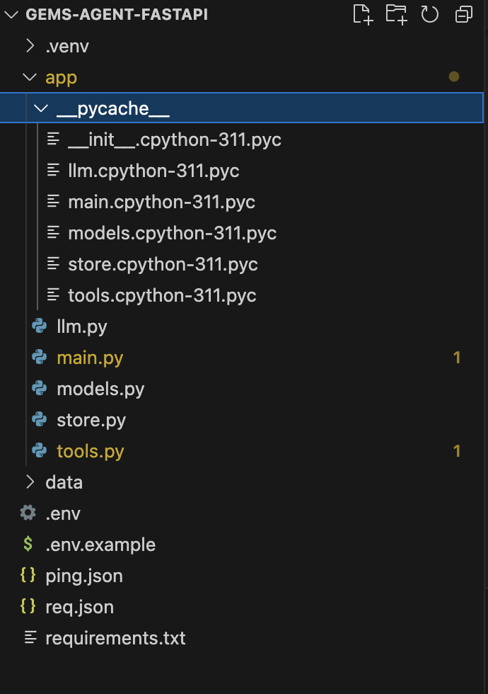
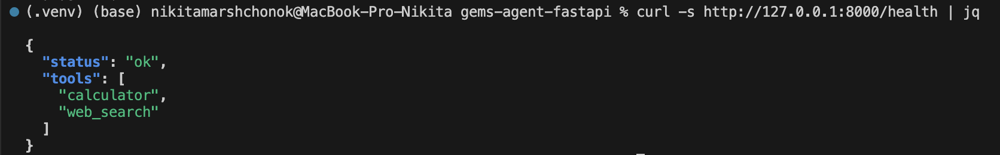
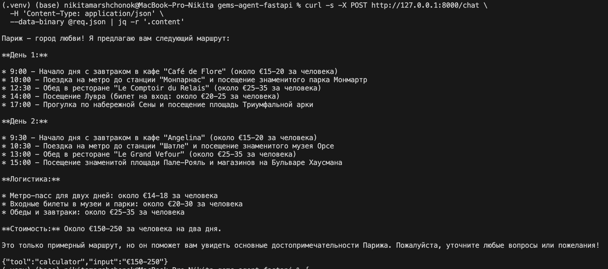
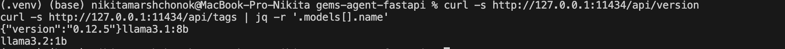
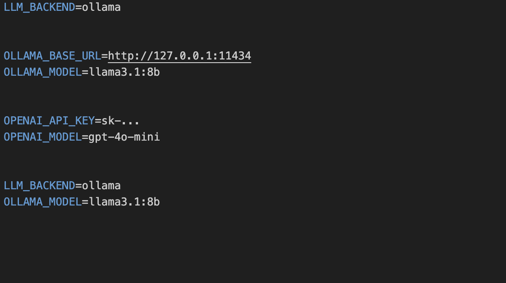

# Gems Agent (FastAPI)

A lightweight "Gems-like" agent server (profiles, tool-use) built on FastAPI with Ollama as the default LLM backend. Comes with ready-made profiles (Travel, Code Helper, English Tutor) and tools (web_search, calculator).

## 📸 Screenshots

Project structure

Ollama version & models

.env (no secrets

Healthcheck OK

Chat result (itinerary)

Tip: If you prefer an English chat send the prompt: “Plan a 2-day itinerary in Paris. Include logistics and approximate prices in EUR. Answer in English only.”

##  Quick Start
Requirements

Python 3.11+

macOS/Linux

Ollama running locally

1) Setup
   python3 -m venv .venv

   source .venv/bin/activate

   pip install -r requirements.txt

